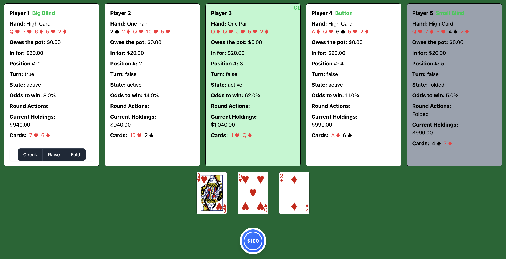

# Poker Table

Poker Table is a real-time, social-first online poker app where friends can play Texas Hold'em from anywhere. Built with Ruby on Rails, it combines seamless gameplay, tournament and cash game formats, and optional video integration for an authentic poker night experience — no chips, no shuffling, just Poker.

🛠️ This project is currently in active development.

🤝 Contributions are welcome! Whether it's a bug fix, feature idea, or design feedback, feel free to open an issue or submit a pull request.

---



## Features

### Poker Engine

- Texas Hold'em poker rules implementation
- Monte Carlo style odds simulations

## Tech Stack

- **Backend**: Ruby on Rails 8.0
- **Frontend**:
  - Hotwire (Turbo + Stimulus)
  - Tailwind CSS
  - Importmaps
- **Database**: SQLite3
- **Real-time Features**: Hotwire
- **Background Jobs**: Solid Queue
- **Testing**: RSpec, Factory Bot
- **Deployment**: Docker + Kamal

## Prerequisites

- Ruby 3.x
- Docker (optional, for containerized deployment)
- SQLite3

## Setup

1. Clone the repository:

   ```bash
   git clone [repository-url]
   cd poker
   ```

2. Install dependencies:

   ```bash
   bundle install
   ```

3. Set up the database:

   ```bash
   bin/db_reset_schema
   ```

4. Start the development server:
   ```bash
   bin/dev
   ```

The application will be available at `http://localhost:3000`

## Development

### Running Tests

```bash
bundle exec rspec
```

### Code Style

The project uses Standard Ruby for code formatting:

```bash
standardrb
```

## TODO

- [ ] Handle All Ins Properly (In Progress)
- [ ] Tournament style (raise blinds every x # of hands)
- [ ] UI
  - [ ] User registration
  - [ ] User authentication and profile management
  - [ ] Custom game creation and management
    - [ ] Bring your own video/audio conference url (Zoom/GMeet/Discord/etc)
    - [ ] Invite players
    - [ ] Schedule games
    - [ ] Manage starting amount, buy ins, buy backs, etc
  - [ ] User game history and statistics
- [ ] Spectatator mode, invite spectators
- [ ] Player bot integration for table filling (check out `ai_players` branch POC)
